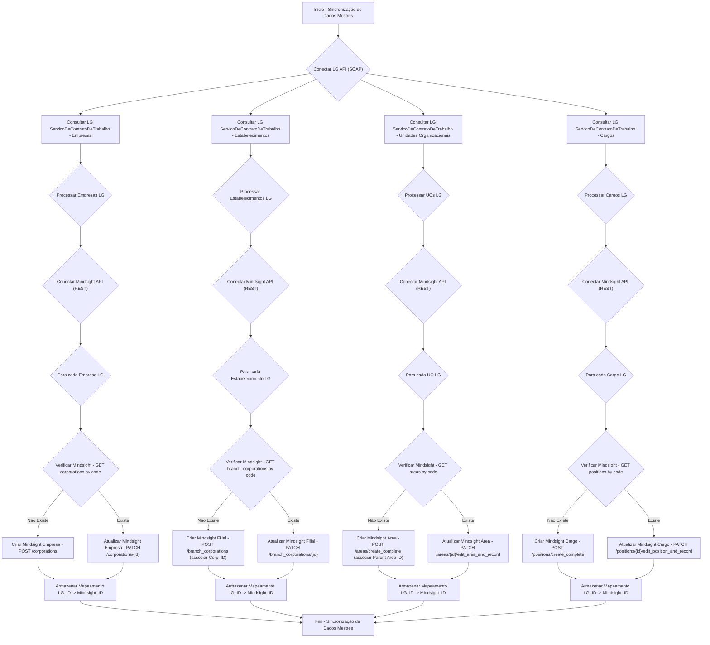
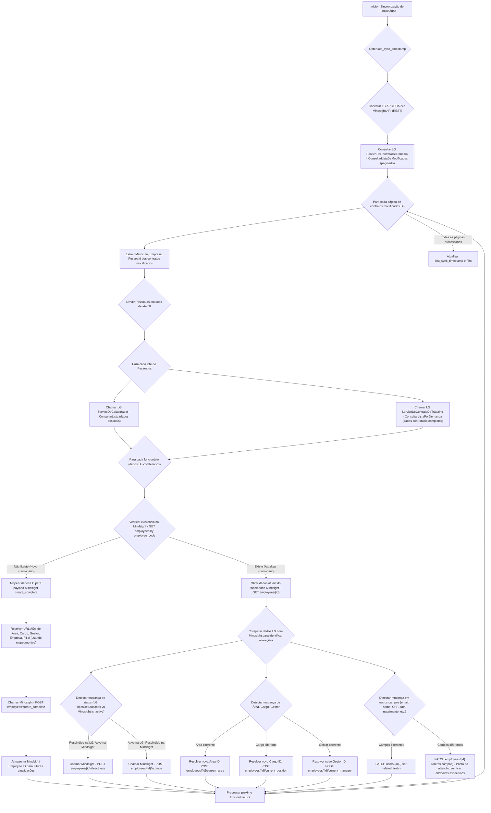

## 1. Entendimento dos Sistemas

### 1.1 Sistema Fonte: LG (Gen.te nuvem API)

*   **Tipo de API:** SOAP.
*   **Autenticação:** `LGAutenticacao` com `TokenUsuario` (Senha, Usuario, GuidTenant) e `LGContextoAmbiente` (Ambiente).
*   **Estrutura de Dados:**
    *   **`ServicoDeContratoDeTrabalho`**: Dados contratuais (data de admissão, cargo, estabelecimento, categoria, situação, tipos de situação, unidade organizacional). Fornece `PessoaId`.
        *   Capacidade `ConsultarListaPorDemanda`: Consulta paginada (50 registros/página). Parâmetros: `PaginaAtual`, `Cargos`, `CentrosDeCustos`, `Empresas`, `Estabelecimentos`, `Situações`, `TiposDeSituacoes` (1,2,3,4 para ativo; 5 para rescisão), `UnidadeOrganizacionais`, `FiltrosEspecificos` (Categoria, Data de início da situação, Data de admissão com operações como "maior que", "menor que").
        *   Capacidade `ConsultarListaDeModificados`: Retorna `Identificação do contrato` (Matrícula, Empresa) e `Operações` (Tipo, Data, Hora) para inclusões, alterações e exclusões de dados de contrato e colaborador. Intervalo de busca máximo de 30 dias.
        *   Capacidades `ConsultarListaDeModificadosPorOcorrencia` (Afastamento, Ferias, Recesso, Rescisao, Movimentacao): Retorna `Identificação do contrato` e `Operações` para inclusões/exclusões de ocorrências.
    *   **`ServicoDeColaborador`**: Dados pessoais (`PessoaId`, nome, data de nascimento, nome da mãe, endereço, contato).
        *   Capacidade `ConsultarLista`: Recebe até 50 `PessoaId` por requisição. Não paginada diretamente, mas usada de forma intercalada com a paginação de contratos.
*   **Filtragem Chave para Sincronia:**
    *   **Ativos:** `ServicoDeContratoDeTrabalho.ConsultarListaPorDemanda` com `TiposDeSituacoes` (1,2,3,4).
    *   **Rescindidos recentes:** `ServicoDeContratoDeTrabalho.ConsultarListaPorDemanda` com `TiposDeSituacoes` (5) e `FiltrosEspecificos` (Data de início da situação, Operação "Maior que" uma data limite).
    *   **Modificados (geral):** `ServicoDeContratoDeTrabalho.ConsultarListaDeModificados` com `PeriodoDeBusca` e `TiposDeOperacoes`.
    *   **Modificados (por ocorrência):** Capacidades específicas (`ConsultarListaDeModificadosPorAfastamento`, etc.).

### 1.2 Sistema Destino: Mindsight (API Controle)

*   **Tipo de API:** REST.
*   **Autenticação:** `Authorization: Token <token>`.
*   **Estrutura de Dados (principais para funcionários):**
    *   **`Funcionários`**: `id` (Mindsight), `employee_code` (código externo, bom para mapear LG Matrícula), `first_name`, `last_name`, `email`, `start_date`, `birth_date`, `gender`, `cpf`, `company_referral`, `work_type`, `work_city`, `systems_permissions`, `corporation`, `branch_corporation`.
    *   **Entidades Relacionadas (`Master Data`):**
        *   `Áreas` (mapeia LG `UnidadeOrganizacionais`): `id`, `code`, `name`, `parent_area`.
        *   `Cargos` (mapeia LG `Cargos`): `id`, `code`, `name`, `category`, `seniority_level`.
        *   `Empresas` (mapeia LG `Empresas`): `id`, `code`, `name`.
        *   `Filiais` (mapeia LG `Estabelecimentos`): `id`, `code`, `name`, `corporation`.
        *   `Users` (associado a funcionários, inclui `username`, `email`, `is_active`, `is_staff`, `is_superuser`).
*   **Endpoints Chave para Sincronia:**
    *   `POST /employees/create_complete/`: Criação de funcionário completo, incluindo `area`, `position`, `manager`, `corporation`, `branch_corporation`.
    *   `POST /employees/{id}/activate/`: Ativa funcionário.
    *   `POST /employees/{id}/deactivate/`: Desativa funcionário.
    *   `POST /employees/{id}/current_area/`: Troca a área atual do funcionário. (Marcado como "não estável")
    *   `POST /employees/{id}/current_manager/`: Troca o gestor atual do funcionário. (Marcado como "não estável")
    *   `POST /employees/{id}/current_position/`: Troca o cargo atual do funcionário. (Marcado como "não estável")
    *   `PATCH /users/{id}/` ou `PUT /users/{id}/`: Atualiza dados do usuário (email, nome, status, etc.).
    *   `PATCH /client1/api/v1/areas/{id}/edit_area_and_record/`: Edita uma área.
    *   `PATCH /client1/api/v1/positions/{id}/edit_position_and_record/`: Edita um cargo.
    *   `PATCH /client1/api/v1/corporations/{id}/` e `PATCH /client1/api/v1/branch_corporations/{id}/`: Edita empresa/filial.
*   **Sincronia Mindsight:** Possui filtros `created_gt` e `modified_gt` para listar dados. Isso é útil para verificar se dados internos da Mindsight foram alterados, mas não para buscar *quais* dados *devem* ser atualizados a partir da LG.
*   **Observações:** Muitos endpoints para alteração de funcionário (área, cargo, gestor) são marcados como "funcionalidade não estável". É crucial validar a estabilidade e o uso desses endpoints com a equipe Mindsight. Para campos diretamente no perfil do funcionário (CPF, data de nascimento, work_type, etc.), não há um `PATCH` genérico listado para `/employees/{id}/`. A atualização desses campos pode ser um ponto de atenção. Assumiremos, para o planejamento, que há uma forma de atualizá-los, seja via um `PATCH` genérico para o funcionário ou através de endpoints específicos não detalhados.

---

## 2. Planejamento da Integração

### 2.1 Estratégia de Sincronização

A LG é a fonte primária de dados. A Mindsight receberá e refletirá essas informações. A estratégia principal será uma sincronização baseada em modificações incrementais, com um processo de carga inicial para dados mestres e funcionários existentes.

1.  **Carga Inicial (Full Load):**
    *   Sincronização de dados mestres (Empresas, Filiais, Unidades Organizacionais, Cargos).
    *   Carga completa de todos os funcionários ativos da LG para a Mindsight.
2.  **Sincronização Contínua (Incremental):**
    *   Monitoramento de alterações na LG (inclusão, alteração, exclusão de contratos/colaboradores, mudanças de ocorrências).
    *   Aplicação dessas alterações na Mindsight.

### 2.2 Mapeamento de Entidades e Campos

**A. Dados Mestres (LG -> Mindsight):**

| LG (Gen.te nuvem)                       | Mindsight (API Controle)                                       | Observações                                                                             |
| :-------------------------------------- | :------------------------------------------------------------- | :-------------------------------------------------------------------------------------- |
| `Empresas`                              | `Empresas` (`/corporations/`)                                | `code` e `name`.                                                                        |
| `Estabelecimentos`                      | `Filiais` (`/branch_corporations/`)                          | `code`, `name`, link para `corporation`.                                                |
| `UnidadeOrganizacionais` (Departamentos) | `Áreas` (`/areas/`)                                          | `code`, `name`, `parent_area` (se houver hierarquia na LG).                             |
| `Cargos`                                | `Cargos` (`/positions/`)                                     | `code`, `name`, `category`, `description`. `seniority_level` pode precisar de mapeamento padrão ou customizado. |
| (Não explícito na LG Doc)               | `Níveis de senioridades` (`/seniority_levels/`)              | Se a LG tiver um conceito de nível, mapear aqui. Caso contrário, pode ser omitido ou padrão. |

**B. Dados de Funcionários (LG -> Mindsight):**

| LG (Gen.te nuvem)                                 | Mindsight (API Controle)                              | Observações                                                                                                       |
| :------------------------------------------------ | :---------------------------------------------------- | :---------------------------------------------------------------------------------------------------------------- |
| `ContratoDeTrabalho.PessoaId`                     | **Mapeamento interno**                               | Será usado para associar `Colaborador` a `ContratoDeTrabalho`.                                                    |
| `Identificação do contrato.Matrícula`             | `employee_code` (para lookup e identificação)         | Crucial para identificar o funcionário na Mindsight.                                                              |
| `Colaborador.Nome`                                | `first_name`, `last_name`                             | Requer lógica para dividir o nome completo em primeiro e último nome.                                             |
| `Colaborador.Email` (inferido)                    | `email` (`users` e `employees`)                       |                                                                                                                   |
| `ContratoDeTrabalho.Data de admissão`             | `start_date` (`employees`)                            |                                                                                                                   |
| `Colaborador.Data de nascimento`                  | `birth_date` (`employees`)                            |                                                                                                                   |
| `Colaborador.CPF` (inferido)                      | `cpf` (`employees`)                                   |                                                                                                                   |
| `Colaborador.Gênero` (inferido)                   | `gender` (`employees`)                                | Mapear para ENUM: "male", "female", "unknown".                                                                    |
| `ContratoDeTrabalho.UnidadeOrganizacionais`       | `area` (URL para Mindsight Area ID)                   | Requer lookup da Mindsight Area `id`/`code` com base no `code` da LG UO.                                          |
| `ContratoDeTrabalho.Cargos`                       | `position` (URL para Mindsight Position ID)           | Requer lookup da Mindsight Position `id`/`code` com base no `code` da LG Cargo.                                   |
| `ContratoDeTrabalho.Gestor` (inferido)            | `manager` (URL para Mindsight Employee ID)            | Requer lookup do Mindsight Employee `id` (do gestor) com base em identificador LG do gestor.                       |
| `ContratoDeTrabalho.Empresas`                     | `corporation` (URL para Mindsight Corporation ID)     | Requer lookup da Mindsight Corporation `id` com base no `code` da LG Empresa.                                     |
| `ContratoDeTrabalho.Estabelecimentos`             | `branch_corporation` (URL para Mindsight BranchCorp ID) | Requer lookup da Mindsight Branch Corporation `id` com base no `code` da LG Estabelecimento.                      |
| `ContratoDeTrabalho.Situações` (Ativo/Inativo)    | `is_active` (`users`), `activate`/`deactivate` (`employees`) | `TiposDeSituacoes` (1,2,3,4) -> ativo; `5` -> inativo.                                                             |
| `ContratoDeTrabalho.Tipo de trabalho` (inferido)  | `work_type` (`employees`)                             | Mapear para ENUM: "hybrid", "inoffice", "remote", "unknown".                                                      |
| `ContratoDeTrabalho.Cidade de trabalho` (inferido) | `work_city` (`employees`)                             |                                                                                                                   |
| `ContratoDeTrabalho.Referência de empresa` (inferido) | `company_referral` (`employees`)                      |                                                                                                                   |
| `ContratoDeTrabalho.Permissões de sistema` (inferido) | `systems_permissions` (`employees`)                   |                                                                                                                   |

### 2.3 Desafios e Considerações

1.  **Lógica de Divisão de Nomes:** A LG provavelmente fornece o nome completo. A Mindsight espera `first_name` e `last_name`. Será necessário implementar uma heurística para dividir o nome (ex: o primeiro nome é o primeiro termo, o último nome são os termos restantes).
2.  **Mapeamento de IDs/Codes:** A Mindsight usa URLs ou IDs numéricos para entidades relacionadas (`area`, `position`, `manager`, `corporation`, `branch_corporation`). Será necessário manter um mapeamento entre os códigos/IDs da LG e os IDs/URLs da Mindsight. Isso geralmente é feito armazenando o ID da Mindsight junto com o código/ID da LG em um sistema de integração ou banco de dados auxiliar.
3.  **Endpoints "Não Estáveis" na Mindsight:** Os endpoints `current_area`, `current_manager`, `current_position` são marcados como instáveis. É fundamental validar seu uso e estabilidade com a equipe Mindsight. Se forem muito instáveis, uma alternativa seria desativar e reativar o funcionário com os novos dados (se `create_complete` suportar `update_complete`, o que não parece ser o caso diretamente).
4.  **Atualização de Campos Diretos de Funcionário na Mindsight:** Não há um `PATCH` ou `PUT` genérico para o recurso `/employees/{id}/` na documentação da Mindsight que abranja todos os campos do funcionário (`cpf`, `birth_date`, `gender`, `work_type`, `work_city`, etc.). A `partialUpdateUser` é para o recurso `/users/{id}/` e não inclui muitos campos do `employee`. Isso é um GAP crítico que precisa ser endereçado com a equipe Mindsight. Assumiremos, por ora, que existe um mecanismo para atualizar esses campos.
5.  **SOAP vs. REST:** A integração exigirá dois clientes de API diferentes e transformações de dados entre os formatos XML (LG) e JSON (Mindsight).
6.  **Paginação e Batching:** O processo de sincronização precisará lidar com a paginação da LG para `ServicoDeContratoDeTrabalho` e a limitação de 50 IDs por requisição para `ServicoDeColaborador`.
7.  **Estado da Sincronização:** Será necessário armazenar o `last_sync_timestamp` para a LG `ConsultarListaDeModificados` para evitar reprocessar dados já sincronizados.
8.  **Tratamento de Erros e Retentativas:** Implementar robustos mecanismos de tratamento de erros, retentativas e logs para garantir a consistência dos dados.
9.  **Identificação de Ativação/Desativação:** Para desativar/reativar funcionários na Mindsight, o sistema de integração precisará comparar o `TiposDeSituacoes` da LG com o status atual do funcionário na Mindsight.

---

## 3. Fluxograma da Integração

Vamos dividir o fluxograma em duas partes principais: **Sincronização de Dados Mestres** (pré-requisito) e **Sincronização de Funcionários** (contínua).

### 3.1 Fluxograma 1: Sincronização de Dados Mestres (LG -> Mindsight)

Este fluxo deve ser executado antes da sincronização de funcionários ou sempre que houver suspeita de dados mestres desatualizados, mas geralmente não é tão frequente quanto a sincronização de funcionários.

### 3.2 Fluxograma 2: Sincronização de Funcionários (LG -> Mindsight)

Este fluxo deve ser executado em intervalos regulares (ex: diariamente, a cada 4 horas).

---

Espero que esta análise detalhada e os fluxogramas ajudem a planejar e implementar sua integração entre a LG (Gen.te nuvem) e a Mindsight (API Controle)! Lembre-se de validar os "pontos de atenção" com a equipe Mindsight.
