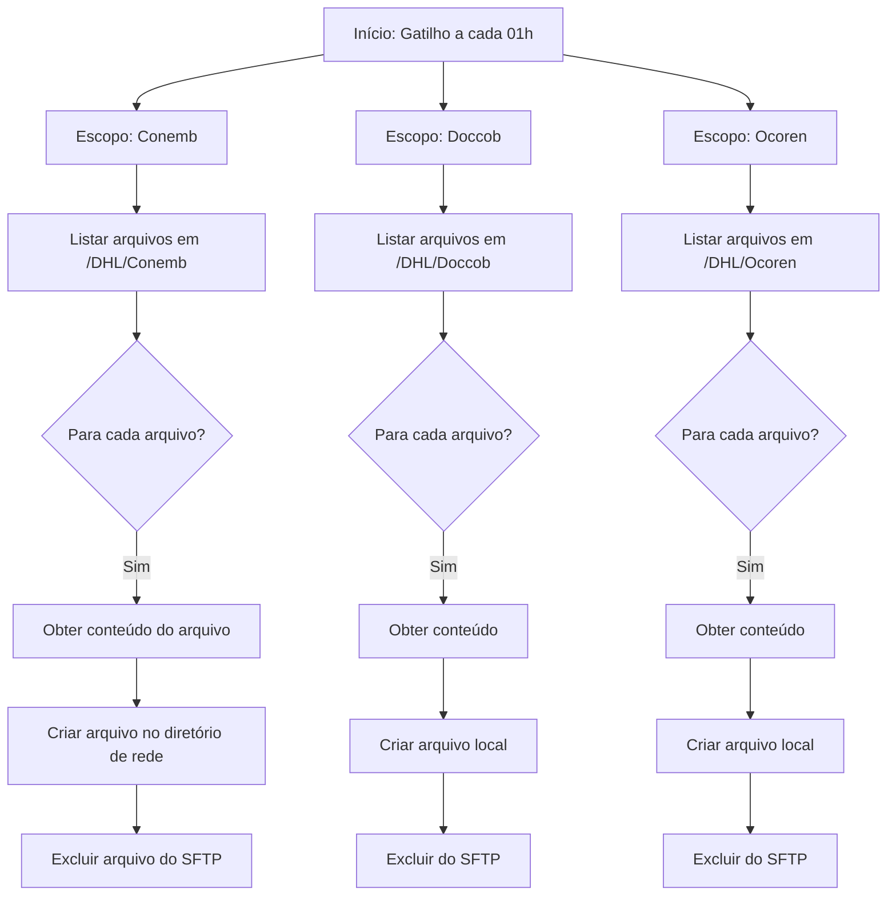

# **Especificação Técnica e Funcional**  
**Fluxo de Automação: SFTP DHL - Download dos arquivos**  
**ID do Fluxo:** `b3be9b71-9825-477a-bad1-3974bc7c7c7f`

---

## **1. Visão Geral**

Este documento descreve a especificação técnica e funcional do fluxo de automação **"SFTP DHL - Download dos arquivos"**, implementado na plataforma **Microsoft Power Automate (Logic Apps)**. O objetivo do fluxo é **baixar diariamente arquivos de três pastas distintas em um servidor SFTP da DHL**, salvá-los em um diretório de rede local (sistema de arquivos) e, em seguida, **excluir os arquivos originais do servidor SFTP** após a conclusão bem-sucedida do download.

---

## **2. Objetivo Funcional**

Automatizar o processo de coleta de arquivos enviados pela DHL por meio de SFTP, garantindo:
- Download diário de arquivos das pastas `/DHL/Conemb`, `/DHL/Doccob` e `/DHL/Ocoren`.
- Armazenamento local dos arquivos em um diretório de rede compartilhado.
- Limpeza do servidor SFTP após o download bem-sucedido, evitando acúmulo de arquivos antigos.

---

## **3. Escopo**

### **Inclui:**
- Leitura de arquivos nas três pastas SFTP especificadas.
- Download do conteúdo de cada arquivo.
- Criação de cópias locais com o mesmo nome do arquivo original.
- Exclusão segura dos arquivos do SFTP após confirmação de download.

### **Não inclui:**
- Validação do conteúdo dos arquivos.
- Notificações em caso de falha (embora alertas de falha estejam habilitados no nível da plataforma).
- Tratamento de arquivos duplicados ou conflitos de nome no destino.

---

## **4. Arquitetura e Componentes**

### **4.1. Gatilho (Trigger)**
- **Tipo:** `Recurrence` (Recorrência)
- **Frequência:** Diária
- **Intervalo:** 1 Hora
- **Horário de início:** `13:00 UTC` (horário configurado para 2025-09-24T13:00:00Z)
- **Descrição:** O fluxo é executado automaticamente a cada 01h

---

### **4.2. Ações Principais**

O fluxo é dividido em **três escopos paralelos**, cada um responsável por uma pasta SFTP específica:

#### **Escopo 1: Movimentação_arquivos_Conemb**
- **Pasta SFTP:** `/DHL/Conemb`  
  *(ID codificado em Base64: `L0RITC9Db25lbWI=`)*
- **Passos:**
  1. **List_files_in_folder_Conemb**: Lista todos os arquivos na pasta `/DHL/Conemb`.
  2. **Apply_to_each**: Itera sobre cada arquivo retornado.
     - **Get_file_content_using_path**: Obtém o conteúdo do arquivo via caminho.
     - **Create_file**: Cria o arquivo no diretório de rede local (`folderPath: "/"`).
     - **Delete_file**: Remove o arquivo do SFTP após download bem-sucedido.

#### **Escopo 2: Movimentação_arquivos_Doccob**
- **Pasta SFTP:** `/DHL/Doccob`  
  *(ID codificado em Base64: `L0RITC9Eb2Njb2I=`)*
- **Passos:** Idênticos ao Escopo 1, aplicados à pasta `/DHL/Doccob`.

#### **Escopo 3: Movimentação_arquivos_Ocoren**
- **Pasta SFTP:** `/DHL/Ocoren`  
  *(ID codificado em Base64: `L0RITC9PY29yZW4=`)*
- **Passos:** Idênticos ao Escopo 1, aplicados à pasta `/DHL/Ocoren`.

> **Observação:** Os três escopos são executados **em paralelo**, pois não há dependência entre eles.

---

## **5. Conexões Utilizadas**

| Conexão | Tipo | Finalidade |
|--------|------|-----------|
| `shared_sftpwithssh` | SFTP com SSH | Acesso ao servidor SFTP da DHL para listagem, leitura e exclusão de arquivos. |
| `shared_filesystem` | Sistema de Arquivos (File System) | Gravação dos arquivos baixados em um diretório de rede local. |

> **Autenticação:** Utiliza parâmetros seguros (`$authentication`) gerenciados pela plataforma Power Automate.

---

## **6. Fluxo de Execução**

---

## **7. Tratamento de Erros e Confiabilidade**

- **Ordem de operações:** A exclusão do arquivo no SFTP só ocorre **após** a criação bem-sucedida do arquivo no diretório de rede (`runAfter: ["Succeeded"]`).
- **Falhas:** Se qualquer etapa falhar (ex: permissão negada, arquivo corrompido), o arquivo **não será excluído**, preservando os dados originais.
- **Alertas:** O fluxo tem `failureAlertSubscription: true`, permitindo notificações de falha via Power Automate (configuração externa necessária).

---

## **8. Parâmetros e Configurações

| Parâmetro | Tipo | Descrição |
|----------|------|----------|
| `$connections` | Object | Referências às conexões SFTP e File System. |
| `$authentication` | SecureObject | Credenciais seguras para autenticação nas APIs. |

> **Nota:** Os valores reais são gerenciados pela plataforma e não expostos no código.

---

## **9. Requisitos de Infraestrutura**

- **Acesso SFTP:** Credenciais válidas com permissões de leitura e exclusão nas pastas `/DHL/Conemb`, `/DHL/Doccob` e `/DHL/Ocoren`.
- **Diretório de Rede:** Caminho de gravação acessível pelo conector `shared_filesystem` (ex: UNC path como `\\servidor\compartilhamento`).
- **Conectividade:** A instância do Power Automate deve ter acesso à internet (para SFTP) e à rede interna (para gravação local).

---

## **10. Considerações de Segurança**

- Credenciais de SFTP são armazenadas de forma segura na plataforma Power Automate.
- Nenhum dado sensível é exposto em logs ou saídas do fluxo.
- A exclusão de arquivos é condicional e segura (só ocorre após sucesso do download).

---

## **11. Manutenção e Monitoramento**

- **Logs de execução:** Disponíveis no portal do Power Automate.
- **Monitoramento recomendado:** Verificar histórico de execuções diárias para garantir que todos os arquivos foram processados.
- **Atualizações:** Qualquer mudança nas pastas SFTP ou credenciais exigirá atualização das conexões.

---

## **12. Histórico de Versões**

| Data | Versão | Autor | Alterações |
|------|--------|-------|-----------|
| 2025-09-24 | 1.0 | Equipe de Integração | Criação inicial |

---

**Documento elaborado com base na definição do fluxo Power Automate (Logic Apps) fornecida.**  
**Última atualização:** 2025-09-24
