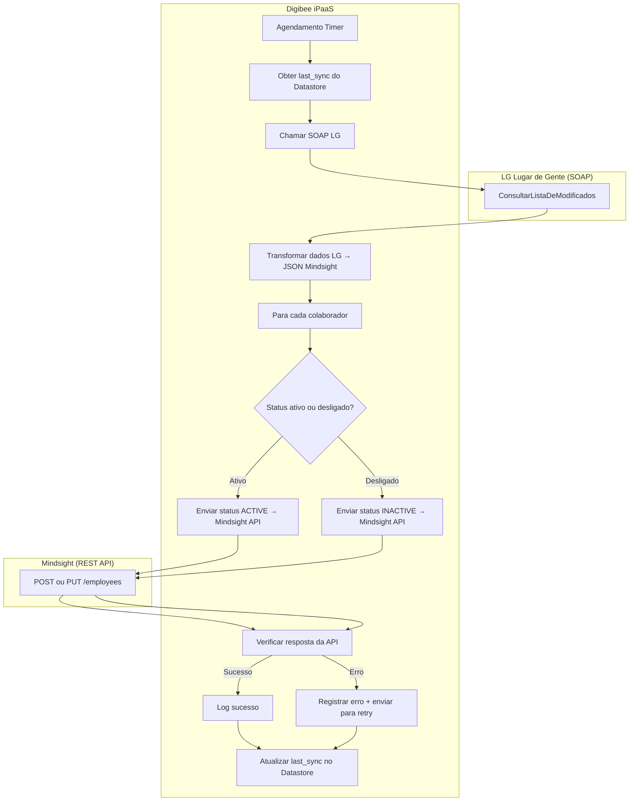

```mermaid


graph TD
    subgraph Fase 2: Sincronização Contínua (Recorrente)
        direction TB

        A2[▶ Início da Sincronização Incremental] --> B2[1. Recuperar 'Data/Hora da Última Sincronização' do estado];
        B2 --> C2["2. Chamar 'ConsultarListaDeModificados' no ServiçoDeContratoDeTrabalho da LG <br> (PeríodoDeBusca: Última Sincronização → Agora)"];
        C2 --> D2{Existem registros modificados?};
        D2 -- Não --> E2[✔ Fim da Sincronização (Sem alterações)];
        D2 -- Sim --> F2[3. Obter lista de Matrículas e tipo de operação (Inclusão, Alteração, Exclusão)];
        
        F2 --> G2{Loop para cada Matrícula Modificada};
        G2 --> H2[4. Consultar dados completos do contrato (ServiçoDeContratoDeTrabalho)];
        H2 --> I2[5. Consultar dados pessoais completos (ServiçoDeColaborador)];
        I2 --> J2[6. Combinar e Traduzir dados];
        J2 --> K2{Qual o tipo de operação?};

        K2 -- Inclusão/Alteração --> L2["7a. Verificar existência na Mindsight <br> via GET /employees/?employee_code={matricula}"];
        L2 -- Existe --> M2["8a. <b>Atualizar Funcionário:</b> <br> Preparar payload e chamar PUT /employees/{id}/"];
        L2 -- Não Existe --> M3["8b. <b>Criar Funcionário:</b> <br> Preparar payload e chamar POST /employees/create_complete/"];
        
        K2 -- Exclusão (Rescisão) --> L3["7b. <b>Desativar Funcionário:</b> <br> Buscar URL em '_actions.deactivate'"];
        L3 -- URL Válida --> M4["8c. Chamar POST para a URL de desativação <br> com data e motivo da rescisão"];
        
        subgraph Pós-Operação Mindsight
            M2 --> N2{Sucesso?};
            M3 --> N2;
            M4 --> N2;
            N2 -- Sim --> O2[9. Logar sucesso];
            N2 -- Não --> O3[9. Logar erro e mover para Fila de Retentativas];
            O2 --> P2{Fim do Loop?};
            O3 --> P2;
        end

```
        P2 -- Não --> G2;
        P2 -- Sim --> Q2[10. Atualizar 'Data/Hora da Última Sincronização' com o horário atual];
        Q2 --> R2[✔ Fim da Sincronização Incremental];
    end

