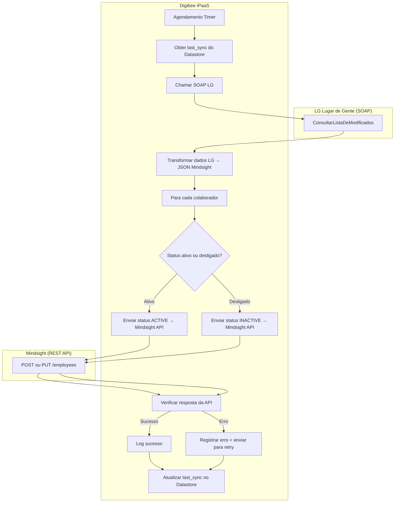

```mermaid
graph TD
    subgraph Sincronizacao Continua
        direction TB

        A2[Inicio da Sincronizacao Incremental] --> B2[1. Recuperar Data/Hora da Ultima Sincronizacao do estado];
        B2 --> C2[2. Chamar ConsultarListaDeModificados no ServicoDeContratoDeTrabalho da LG\nPeriodo de Busca: UltimaSincronizacao -> Agora];
        C2 --> D2{Existem registros modificados?};
        D2 -- Nao --> E2[Fim da Sincronizacao - Sem alteracoes];
        D2 -- Sim --> F2[3. Obter lista de Matriculas e tipo de operacao - Inclusao, Alteracao, Exclusao];
        
        F2 --> G2{Loop para cada Matricula Modificada};
        G2 --> H2[4. Consultar dados completos do contrato - ServicoDeContratoDeTrabalho];
        H2 --> I2[5. Consultar dados pessoais completos - ServicoDeColaborador];
        I2 --> J2[6. Combinar e Traduzir dados];
        J2 --> K2{Qual o tipo de operacao?};

        K2 -- Inclusao/Alteracao --> L2[7a. Verificar existencia na Mindsight\nGET /employees/?employee_code={matricula}];
        L2 -- Existe --> M2[8a. Atualizar Funcionario\nPreparar payload e chamar PUT /employees/{id}/];
        L2 -- Nao Existe --> M3[8b. Criar Funcionario\nPreparar payload e chamar POST /employees/create_complete/];
        
        K2 -- Exclusao Rescisao --> L3[7b. Desativar Funcionario\nBuscar URL em _actions.deactivate];
        L3 -- URL Valida --> M4[8c. POST para a URL de desativacao\ncom data e motivo da rescisao];
        
        subgraph Pos-Operacao Mindsight
            M2 --> N2{Sucesso?};
            M3 --> N2;
            M4 --> N2;
            N2 -- Sim --> O2[9. Logar sucesso];
            N2 -- Nao --> O3[9. Logar erro e mover para Fila de Retentativas];
            O2 --> P2{Fim do Loop?};
            O3 --> P2;
        end

        P2 -- Nao --> G2;
        P2 -- Sim --> Q2[10. Atualizar Data/Hora da Ultima Sincronizacao\ncom o horario atual];
        Q2 --> R2[Fim da Sincronizacao Incremental];
    end

```
